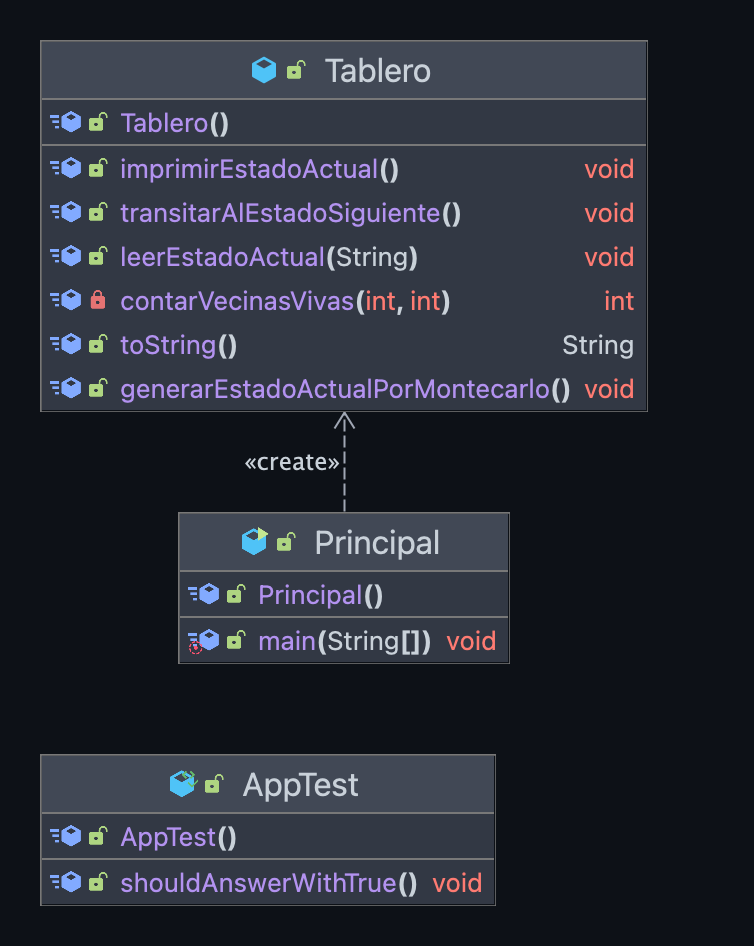
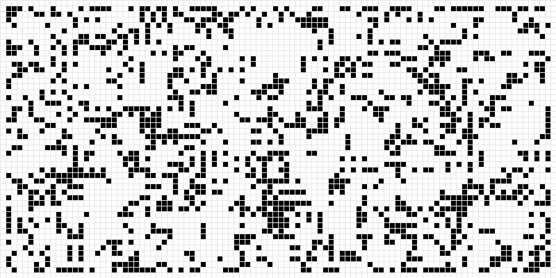

# Práctica II - GAME OF LIFE


<p style="text-align: justify;">

*Copyright [2023] [Daniel Fernández López]
Licensed under the Apache License, Version 2.0 (the "License");
you may not use this file except in compliance with the License.
You may obtain a copy of the License at*

    http://www.apache.org/licenses/LICENSE-2.0

*Unless required by applicable law or agreed to in writing, software
distributed under the License is distributed on an "AS IS" BASIS,
WITHOUT WARRANTIES OR CONDITIONS OF ANY KIND, either express or implied.
See the License for the specific language governing permissions and
limitations under the License.*

</p>

## Descripción:

<p style="text-align: justify;">
El objetivo de esta práctica es poder desarrollar de una aplicación en Java, 
que implemente el Juego de la Vida de Conway.
</p>

## Requisitos:

* Si una célula está viva y dos o tres de sus vecinas también lo están, entonces continúa viva en el estado siguiente.
* Si una célula está muerta y tres de sus vecinas están vivas, entonces pasa a estar viva en el estado siguiente.
* El resto de células pasan a estar muertas en el estado siguiente.
* El estado de las células se representa mediante un tablero de 30x30.

## Desarrollo:

* El programa se ha desarrollado en Java, utilizando la herramienta Maven para la gestión de dependencias y la creación del JAR.
* Para la gestión de la lógica del juego se ha utilizado la librería JUnit.
* Para la gestión de la versión se ha utilizado la herramienta Git.
* Para la gestión de la licencia se ha utilizado la herramienta Apache.
* Para la gestión de la configuración se ha utilizado la herramienta Maven.


# Funcionamiento:

* El programa se ejecuta mediante la línea de comandos.
* Una vez clonado el repositorio, se debe acceder a la carpeta del proyecto y ejecutar el siguiente comando:

```
mvn package
```

<p style="text-align: justify;">
Comprobar que se ha cargado y creado correctamente el directorio target, en el que se encuentra el archivo "JVII-1.0-SNAPSHOT.jar"
que es el que se debe ejecutar.
</p>

* Para compilar el programa se debe introducir el siguiente comando:

```
mvn compile 
```

* Para ejecutar el programa se debe introducir el siguiente comando:

```
java -cp target/JVII-1.0-SNAPSHOT.jar org.example.aplicacion.Principal
```

<p style="text-align: justify;">
Después de ejecutar el comando, se mostrarán por pantalla las simulaciones (transiciones) del tablero de
30x30, con las células vivas y muertas.
<br>
Las células vivas se representan con el carácter "0" y las muertas con el carácter "1".
</p>
<br>

## Diagrama de clases:



<br>

<p style="align-content: center">

</p>